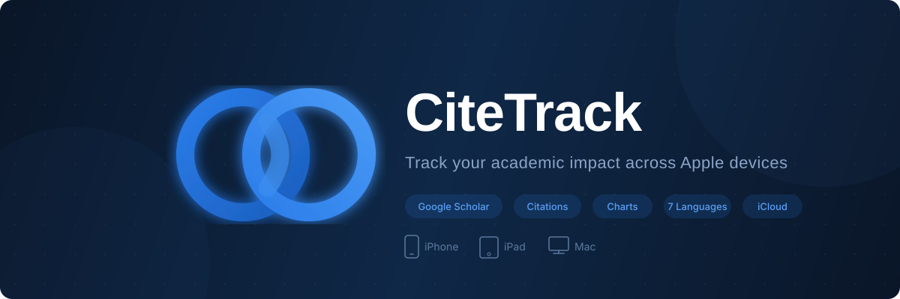

<div align="center">

  

  <br><br>

  

  <br><br>

  <a href="https://apps.apple.com/app/citetrack/id6752281652">
    
  </a>
  &nbsp;
  <a href="https://github.com/tao-shen/CiteTrack/releases/latest">
    
  </a>

  <br><br>

  <a href="https://github.com/tao-shen/CiteTrack/releases/latest"></a>
  <a href="https://apps.apple.com/app/citetrack/id6752281652"></a>
  <a href="LICENSE"></a>
  <a href="https://github.com/tao-shen/CiteTrack/stargazers"></a>
  <a href="https://github.com/tao-shen/CiteTrack/issues"></a>
  
  

</div>

<br>

---

## Why CiteTrack?

For researchers, citation counts are more than vanity metrics — they measure the **real-world impact** of your work. Yet Google Scholar offers no native app, no push notifications, and no way to visualize trends over time.

**CiteTrack fills that gap.** It's a native Apple app that turns raw Google Scholar data into actionable insights — so you can focus on research, not refreshing browser tabs.

### What makes it different

| | CiteTrack | Browser Bookmarks | Other Tools |
|---|---|---|---|
| **Native Apple experience** | SwiftUI + AppKit | - | Mostly web-based |
| **Real-time push alerts** | Yes | - | Limited |
| **Rich chart visualizations** | 4 chart types | - | Basic |
| **Who Cites You analysis** | Yes, with export | - | Rare |
| **Citation context (AI)** | Semantic Scholar | - | - |
| **iCloud sync** | Yes | - | Account required |
| **Home screen widgets** | Yes | - | - |
| **7 languages** | Yes | N/A | English only |
| **Privacy-first** | 100% on-device | Depends | Cloud-dependent |
| **Free & open source** | MIT | N/A | Paid / closed |

---

## Features

### Dashboard
At-a-glance overview of all tracked scholars — total citations, h-index, i10-index, and recent growth. One tap to refresh.

### Multi-Scholar Tracking
Add any researcher by Google Scholar profile URL or ID. Track colleagues, collaborators, or leading voices in your field — all in one place.

### Advanced Charts
Four visualization modes — **line**, **bar**, **area**, and **heatmap** — with adjustable time ranges. Spot trends, compare periods, and export charts.

### Who Cites You
Browse every paper that cites your work. Filter by year, keyword, or author. Export results to **CSV** or **JSON** for further analysis.

### Citation Context (Powered by Semantic Scholar)
See *how* other papers cite your work — with surrounding context snippets and sentiment analysis. Understand your academic influence at a deeper level.

### Smart Notifications
Get push alerts the moment your citation count changes. Never miss a milestone.

### iCloud Sync
Seamlessly sync your tracked scholars and history across iPhone, iPad, and Mac via CloudKit. Opt-in, zero-config.

### Home Screen Widgets
WidgetKit-powered widgets display citation stats right on your iOS home screen.

### macOS Menu Bar
Lightweight menu bar presence on macOS for quick citation checks without opening the full app.

### 7 Languages
English · 中文 · 日本語 · 한국어 · Español · Français · Deutsch

---

## Example

<div align="center">
  
  <br>
  <sub>Tracking Geoffrey Hinton's citation metrics with CiteTrack on macOS</sub>
</div>

---

## Installation

### App Store (Recommended)

<a href="https://apps.apple.com/app/citetrack/id6752281652">
  
</a>

Available for **iPhone**, **iPad**, and **Mac** — a single universal purchase.

### Direct Download (macOS)

Download the latest `.dmg` from [GitHub Releases](https://github.com/tao-shen/CiteTrack/releases/latest). Open, drag to Applications, done.

### Build from Source

```bash
git clone https://github.com/tao-shen/CiteTrack.git
cd CiteTrack

# iOS / iPadOS
xcodebuild -project iOS/CiteTrack_iOS.xcodeproj \
  -scheme CiteTrack -configuration Release \
  -destination 'generic/platform=iOS' build

# macOS
xcodebuild -project macOS/CiteTrack_macOS.xcodeproj \
  -scheme CiteTrack -configuration Release build
```

> **Requirements:** Xcode 15+, Swift 5.9+, macOS 12+ / iOS 15+. iOS device deployment requires an Apple Developer account.

---

## Architecture

```
CiteTrack/
├── iOS/                          # SwiftUI app + WidgetKit extension
│   ├── CiteTrack/
│   │   ├── Views/                # Tab views, charts, citation context
│   │   ├── Services/             # Google Auth, platform-specific services
│   │   └── CiteTrackApp.swift    # App entry, sidebar (iPad) + tab bar (iPhone)
│   └── CiteTrackWidget/          # Home screen widgets
│
├── macOS/                        # AppKit app + menu bar
│   ├── Sources/                  # Window controllers, chart engine
│   └── assets/                   # App icons, screenshots
│
├── Shared/                       # Cross-platform core (80%+ of logic)
│   ├── Services/                 # CitationFetch, GoogleScholar, CloudKit,
│   │                             # SemanticScholar, Analytics, Notifications
│   ├── Managers/                 # CitationManager, AppConfig, iCloudSync
│   ├── Models/                   # Scholar, CitingPaper, CitationHistory,
│   │                             # CitationContext
│   ├── CoreData/                 # Persistence stack + migrations
│   └── Localization/             # 7 languages, LocalizationManager
│
└── scripts/                      # Build & deployment automation
```

**Design principles:**
- **Shared-first** — 80%+ of business logic lives in `Shared/`, consumed by both platforms
- **Native UI** — SwiftUI on iOS/iPadOS, AppKit on macOS, each optimized for its platform
- **Local-first** — all data on-device, iCloud sync opt-in, no account required
- **Modular services** — clean separation between data fetching, persistence, analytics, and UI

### Tech Stack

| Layer | Technology |
|---|---|
| iOS / iPadOS UI | SwiftUI, WidgetKit, UIKit (tab bar) |
| macOS UI | AppKit, custom chart engine |
| Networking | URLSession, Google Scholar parsing |
| Citation Context | Semantic Scholar API |
| Persistence | Core Data, UserDefaults (App Group) |
| Cloud Sync | CloudKit (iCloud) |
| Auth | Google Sign-In (iOS) |
| Auto-Update | Sparkle (macOS direct download) |
| Localization | 7 languages, runtime switching |

---

## Privacy & Security

CiteTrack is designed with privacy as a core principle:

- **100% on-device processing** — no server, no account, no tracking
- **iCloud sync is opt-in** — your data stays on your device unless you choose otherwise
- **No personal data collected** — the app only accesses publicly available Google Scholar pages
- **Open source** — inspect every line of code yourself

---

## Roadmap

- [ ] Citation trend predictions with ML
- [ ] Collaboration network visualization
- [ ] PDF library integration
- [ ] Apple Watch complication
- [ ] Shortcuts & Siri integration

---

## Contributing

Contributions are welcome! Whether it's a bug fix, new feature, or translation improvement:

1. Fork the repository
2. Create your feature branch (`git checkout -b feature/amazing-feature`)
3. Commit your changes (`git commit -m 'Add amazing feature'`)
4. Push to the branch (`git push origin feature/amazing-feature`)
5. Open a Pull Request

For bugs and feature requests, please [open an issue](https://github.com/tao-shen/CiteTrack/issues).

---

## License

This project is licensed under the MIT License — see the [LICENSE](LICENSE) file for details.

---

<div align="center">

  **Built for the research community**

  <a href="https://github.com/tao-shen">Tao Shen</a> · <a href="https://apps.apple.com/app/citetrack/id6752281652">App Store</a> · <a href="https://github.com/tao-shen/CiteTrack/releases">Releases</a>

  <br>

  If CiteTrack helps your research workflow, consider giving it a star

</div>
